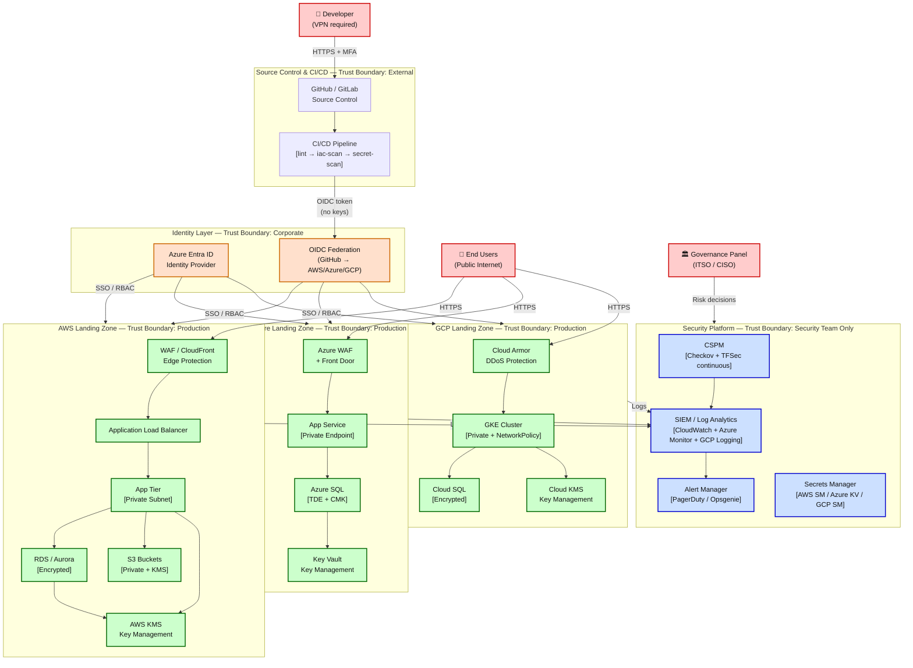

# High-Level Design (HLD) — Target State Secure Architecture

**Module:** 10 — Architecture  
**View:** System context — major building blocks, trust boundaries, data flow  
**Audience:** Governance panel / non-technical stakeholders

---

## HLD Diagram

---

## Trust Boundaries

| Boundary | What It Protects | Mechanism |
|----------|-----------------|-----------|
| **External → SC** | Prevent unauthorised code push | MFA + branch protection + required reviewers |
| **SC → Cloud** | Prevent credential theft | OIDC tokens (1-hour, no long-lived keys) |
| **Public → Edge** | DDoS, injection, bot attacks | WAF + Cloud Armor + rate limiting |
| **Edge → App** | Direct database access | Private subnets, no public IPs on DB |
| **App → Security** | Log tampering | Immutable log archive (separate account) |
| **Human → Cloud** | Unauthorised admin access | MFA + Conditional Access + JIT |

---

## Data Flow (Non-Technical Description)

1. **Developer** pushes code → Pipeline scans for secrets + misconfigs before merge
2. **Pipeline** deploys to cloud using short-lived token (no password stored)
3. **User** hits WAF edge → request routed to private app tier
4. **App** reads encrypted database → decryption key fetched from KMS (never stored in code)
5. **Every action** logs to centralised SIEM → alerts fire on anomalies
6. **ITSO** reviews risk dashboard → approves exceptions via governance workflow

---

## What Changed vs Current State

| Current State | Target State |
|---------------|--------------|
| Hardcoded credentials in code | OIDC + IAM roles (no credentials) |
| No CSPM | Checkov + TFSec continuous scanning |
| Inconsistent logging | Centralised SIEM (all 3 clouds) |
| No MFA enforcement | Conditional Access (all admins) |
| Public S3 buckets | Private + KMS encrypted |
| No secrets management | AWS SM / Azure KV / GCP SM |
