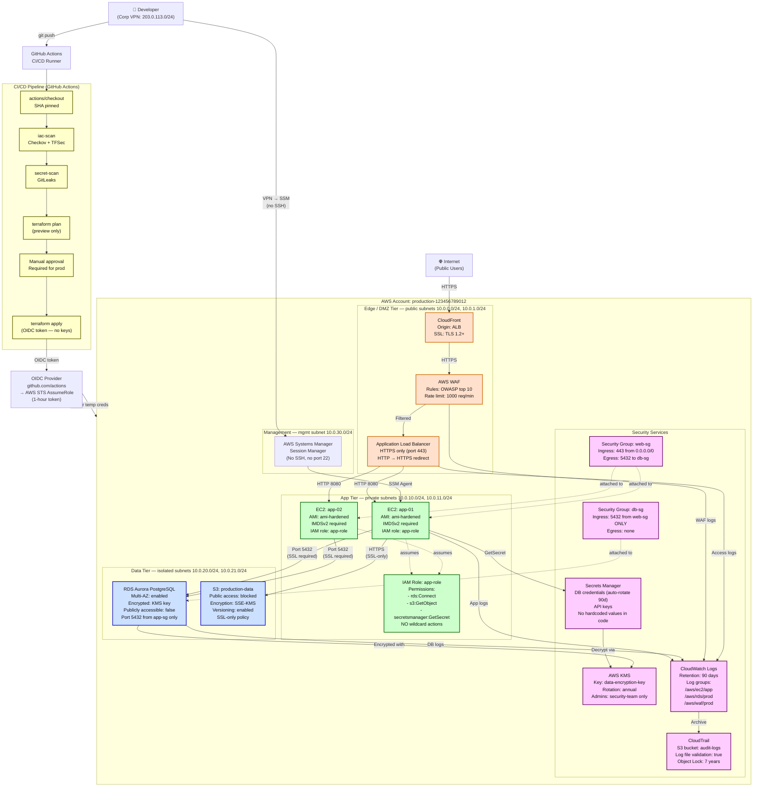

# Low-Level Design (LLD) — AWS Production Slice

**Module:** 10 — Architecture  
**View:** Implementation detail — engineer-facing, one representative slice  
**Slice:** AWS ingress → App → RDS + the CI/CD path that provisions it

---

## LLD Diagram: AWS Production Path

---

## Port/Protocol Detail

| Source | Destination | Port | Protocol | Notes |
|--------|-------------|------|----------|-------|
| Internet | CloudFront | 443 | HTTPS/TLS 1.2+ | HTTP → 301 redirect |
| CloudFront | ALB | 443 | HTTPS | Origin shield enabled |
| ALB | EC2 | 8080 | HTTP | Internal only, private subnet |
| EC2 | RDS | 5432 | PostgreSQL/SSL | `rds.force_ssl=1` |
| EC2 | S3 | 443 | HTTPS | SSL-only bucket policy |
| EC2 | Secrets Manager | 443 | HTTPS | VPC endpoint |
| EC2 | KMS | 443 | HTTPS | VPC endpoint |
| Admin | EC2 | (none) | SSM Session | No port 22, no SSH key |
| CI/CD | AWS | 443 | HTTPS | OIDC STS token exchange |

---

## IAM: Specific Permissions per Component

| Component | Role | Permissions | NOT granted |
|-----------|------|-------------|-------------|
| EC2 (app) | `app-role` | `rds:Connect`, `s3:GetObject`, `secretsmanager:GetSecret` | `s3:DeleteObject`, `iam:*`, `ec2:*` |
| CI/CD | `cicd-deploy-role` | `ec2:DescribeInstances`, `s3:PutObject` (deploy bucket) | `iam:CreateUser`, `rds:DeleteDBInstance` |
| RDS | N/A (managed) | Internal only | No public IAM role needed |
| CloudTrail | `cloudtrail-role` | `s3:PutObject` (audit bucket) | Read access to audit bucket |

---

## Encryption at Every Layer

| Layer | At Rest | In Transit | Key Location |
|-------|---------|------------|-------------|
| EC2 root volume | KMS CMK | N/A | AWS KMS |
| RDS data | KMS CMK | TLS (force_ssl=1) | AWS KMS |
| S3 objects | SSE-KMS | SSL-only policy | AWS KMS |
| Secrets Manager | KMS CMK | HTTPS | AWS KMS |
| CloudTrail logs | SSE-S3 | HTTPS | AWS managed |

---

## Where Pipeline + Detection Sit

| Component | Physical Location | Integration |
|-----------|------------------|-------------|
| CI/CD (GitHub Actions) | GitHub-hosted runner | Deploys via OIDC → no credentials stored |
| Checkov/TFSec | CI/CD runner | Runs on PR — blocks merge if CRITICAL |
| GitLeaks | CI/CD runner | Blocks push if secrets found |
| CloudWatch | AWS managed | Receives logs from EC2, RDS, WAF, ALB |
| CloudTrail | AWS managed | Immutable audit trail in S3 (Object Lock) |
| SSM Session Manager | AWS managed | Admin access (no SSH port open) |
